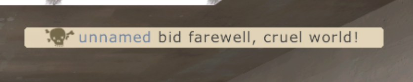

# X360 TF2 Quality-of-Life Patches

Made with Opus 5.5 on Medium effort. I don't take credit for the output presented. I only tested the patches and made this document more readable.

Patches for `tf\bin\Client_360.dll` from the Xbox 360 release of The
Orange Box. Each one ports a piece of current PC Team Fortress 2 behaviour into
the 2007 (360) client.

| Patch | What it does |
|---|---|
| `deathnotice` | Kill feed text you're involved in is dark grey instead of white, so it reads on a cream background |
| `ubercharge` | The Medic HUD label shows the charge, e.g. "ÜBERCHARGE: 69%". Nice. |

<p>
  
  
</p>

That's it. All it does is this.

## Requirements
- `tf2_360_qol_patches.exe` from the Releases page, or built from source
  ([docs/building.md](docs/building.md))
- your own `Client_360.dll` and `zip0.360.zip`, which aren't included here
- xorloser's xextool (tested with v6.3), to decrypt and re-encrypt the DLL
- xdelta3, or any xdelta patcher, for `attachments/resources.xdelta`

## Quick start
1. In `tf\bin`, rename `Client_360.dll` to `Client_360.dll.orig` (to back it up), then write
   the patched copy under the original name:
   ```
   tf2_360_qol_patches Client_360.dll.orig Client_360.dll --xextool C:\tools\xextool.exe
   ```
2. Patch the resource files, see [resource files](#resource-files).

## Resource files
`attachments/resources.xdelta` edits three files inside the game's own
`tf\zip0.360.zip`:

| File | Change |
|---|---|
| `resource\tf_english.txt` | `TF_Ubercharge` -> `"ÜBERCHARGE: %charge%%%"` |
| `scripts\hudlayout.res` | `LocalBackgroundColor` in `HudDeathNotice` becomes cream |
| `resource\ui\hudmediccharge.res` | the Medic charge meter layout, makes font smaller |

In `tf`, rename `zip0.360.zip` to `zip0.360.zip.orig` (to back it up), then:

```
xdelta3 -d -s zip0.360.zip.orig resources.xdelta zip0.360.zip
```

The zip keeps its size and everything else in it stays the same. The patch
was tested on two retail copies of the zip that differ in other files; both
patched cleanly.

## Usage
```
tf2_360_qol_patches <in Client_360.dll> <out Client_360.dll> [--only a,b] [--xextool <path>]
tf2_360_qol_patches --check <Client_360.dll>... [--only a,b] [--xextool <path>]
```

Every patch is applied unless `--only` names some, e.g.
`--only ubercharge`. `--check` reports each patch per file as `patchable`,
`done` or `n/a`, and writes nothing.

The tool looks for xextool in this order: `--xextool`, the `XEXTOOL`
environment variable, then `PATH`. A DLL that is already decrypted and
uncompressed doesn't need it.

Xenia applies game patches by module hash, so patching the DLL turns off any
Xenia patch file made for it, such as
`4541080F - The Orange Box (tf-bin-Client_360.dll).patch.toml`. To turn it back
on, replace its `hash` value with the new "Module Hash" that `xenia.log` shows
for `Client_360.dll`.

## Supported builds
| Build | `Client_360.dll` MD5 | Result |
|---|---|---|
| Disc | `c75aeff03fa7225d7037db670e0dc47d` | both patches |
| Title Update 5 | `58c472372a74dbca9ce4a7c497479bf2` | both patches |

Both patches have been played on the disc build in Xenia Canary. On TU5 the
patched code was only checked in a disassembler, not in game. Any other DLL is
refused and left unchanged.

## More
- [docs/patches.md](docs/patches.md): what each patch changes, compared with PC
- [docs/internals.md](docs/internals.md): addresses, the PowerPC changes, testing
- [docs/building.md](docs/building.md): building from source

## Why?
I was bored. They're minor for a reason: for people who play this game regularly. Perhaps they wanna see their Übercharge number directly instead of doing quick arithmetic in their head to figure it out, I don't know.

## License
MIT, see [LICENSE](LICENSE). Covers the patcher only, not the game's files.